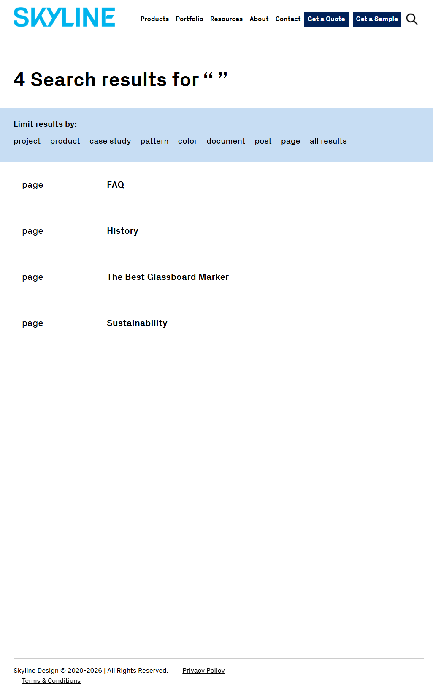

# BUG-002: Whitespace-only search query returns partial results instead of full-content fallback

**Test Case:** TC-SEARCH-RESULTSPAGE-003
**Feature:** search
**Flow:** results-page
**Priority:** Medium
**Severity:** Medium
**Date Found:** 2026-09-25
**Source Report:** reports/search-2026-09-25-083758

## Description
A whitespace-only search query (`"   "`) does not fall back to the full site content set the way an empty query does. Instead it returns only 4 results, giving users an incomplete and inconsistent result set for what should be equivalent input.

## Steps to Reproduce
1. Navigate to https://dev.skyline.glass/?s=%20%20%20

## Expected Result
Page loads without error; result set matches the same fallback behavior as an empty query (no crash, no unhandled exception).

## Actual Result
Page loaded without error (title 'You searched for - Skyline', 0 console errors, 39 warnings). However, the whitespace-only query returned heading '4 Search results for " "' with only 4 results (FAQ, History, The Best Glassboard Marker, Sustainability) instead of falling back to the full site content set, as an empty query does (716 items observed for TC-SEARCH-RESULTSPAGE-002). Result was consistent across 2 attempts (same page, same 4 results both times).

## Screenshot

## Environment
- Environment: dev
- URL: https://dev.skyline.glass/
- Browser: Playwright default chromium

## Console Errors
None

## Note
A duplicate bug report for this same TC-ID and source report already exists as BUG-001 (open PR #4, branch `bug/search-2026-09-25-114500`). This report (BUG-002) was created in addition, at explicit user request, despite the duplication.
